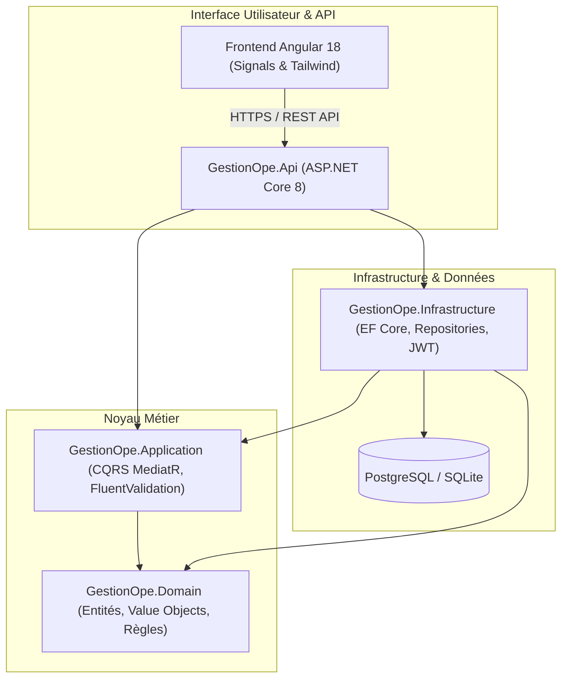
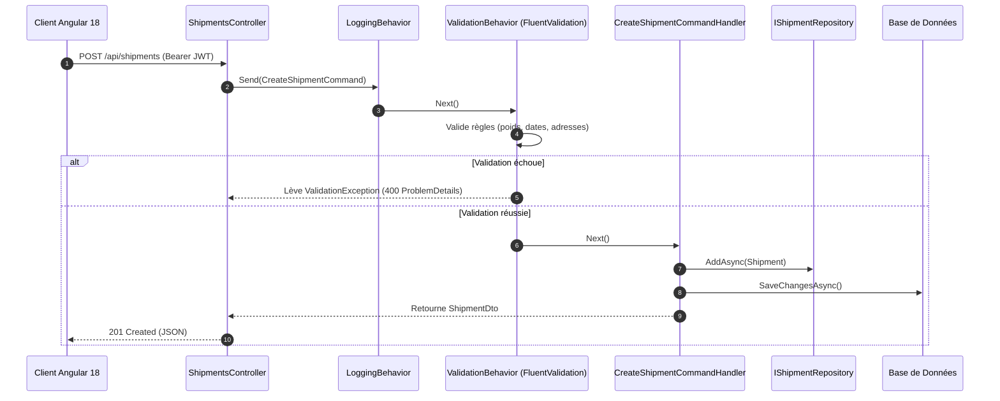

# 🚀 Gestion_Ope - Plateforme SaaS de Gestion Opérationnelle & Logistique

[](https://dotnet.microsoft.com/)
[](https://angular.dev/)
[](https://tailwindcss.com/)
[](https://www.docker.com/)
[](https://azure.microsoft.com/)
[](https://xunit.net/)

**Gestion_Ope** est une plateforme SaaS vitrine d'excellence dédiée à la **supervision logistique, au suivi du fret multi-modal et à l'optimisation des flux inter-entrepôts**. Elle illustre les meilleures pratiques d'ingénierie logicielle contemporaines en combinant une **Clean Architecture .NET 8** stricte et un frontend **Angular 18 moderne 100% Standalone Components** propulsé par les **Angular Signals**.

---

## 🏛️ 1. Architecture Logicielle

### Vue d'ensemble Clean Architecture (.NET 8)



### Flux de Traitement CQRS avec MediatR & Pipeline Behaviors



---

## 💎 2. Caractéristiques & Piliers Techniques

### Backend (.NET 8)
- **Clean Architecture** : Découpage strict en 4 couches indépendantes (`Domain`, `Application`, `Infrastructure`, `Api`).
- **CQRS avec MediatR 12** : Découplage complet des commandes d'écriture et des requêtes de lecture.
- **Validation déclarative avec FluentValidation** : Pipeline behavior interceptant automatiquement toute requête non conforme.
- **Gestion des erreurs RFC 7807** : `GlobalExceptionHandlerMiddleware` produisant des `ProblemDetails` standardisés.
- **Sécurité & Authentification JWT** : Schéma Bearer sécurisé avec RBAC (*Admin*, *LogisticsManager*, *WarehouseOperator*, *Dispatcher*).
- **Persistance EF Core** : Support natif double cible (PostgreSQL en production/Docker, SQLite portable sans friction).
- **Seeding de données réalistes** : 4 hubs majeurs (Roissy, Lyon Saint-Exupéry, Marseille-Fos, Lille), transporteurs actifs, expéditions multi-statuts et incidents SLA.

### Frontend (Angular 18)
- **100% Standalone Components** : Utilisation exclusive de la nouvelle architecture Angular moderne (`bootstrapApplication`, pas de `NgModule`).
- **Gestion d'état réactive par Signals** : Remplacement des flux RxJS complexes dans les composants par `signal()`, `computed()` et `effect()`.
- **UI Responsive sous TailwindCSS** : Palette Slate/Indigo/Emerald/Rose, composants modernes (modales, badges de statut, jauges de saturation volumétrique).
- **Timeline de Suivi Interactive** : Visualisation chronologique des checkpoints d'expédition et alertes d'incidents.
- **Portail de Connexion en 1 Clic** : Boutons d'accès rapide préconfigurés pour tester instantanément chaque rôle utilisateur.

### DevOps & Cloud Azure
- **Docker Multi-stage** : Images minimales et durcies (ASP.NET 8 non-root et Nginx Alpine SPA).
- **Docker Compose** : Environnement complet prêt à l'emploi (`db`, `api`, `frontend`).
- **CI/CD GitHub Actions** : Validation systématique des builds .NET et Angular, exécution des tests unitaires et d'intégration, vérification des conteneurs.
- **Infrastructure as Code (Azure Bicep)** : Déploiement automatisé sur **Azure Container Apps**, Azure Container Registry et Log Analytics.

---

## 🔑 3. Comptes Démo Préconfigurés

| Rôle | Adresse E-mail | Mot de Passe | Privilèges |
| :--- | :--- | :--- | :--- |
| **Administrateur** | `admin@gestionope.fr` | `Admin123!` | Accès complet, création de hubs, gestion globale |
| **Responsable Logistique** | `manager@gestionope.fr` | `Manager123!` | Gestion fret, affectation transporteurs, résolution incidents |
| **Opérateur Entrepôt** | `operator@gestionope.fr` | `Operator123!` | Pointage des statuts, mise à jour des checkpoints |

---

## 🚀 4. Démarrage Rapide

### Option A : Lancement Local (Développement)

#### 1. Lancer le Backend
```bash
cd backend
dotnet run --project src/GestionOpe.Api/GestionOpe.Api.csproj
```
- **API Swagger UI** : [http://localhost:5000/swagger](http://localhost:5000/swagger)
- **Health Check** : [http://localhost:5000/health](http://localhost:5000/health)

#### 2. Lancer le Frontend
```bash
cd frontend
npm install
npm start
```
- **Application Web** : [http://localhost:4200](http://localhost:4200)

---

### Option B : Lancement Complet via Docker Compose
```bash
# À la racine du projet
docker compose up --build
```
- Frontend Web : [http://localhost:4200](http://localhost:4200)
- API Backend : [http://localhost:5000/swagger](http://localhost:5000/swagger)
- Base PostgreSQL : `localhost:5432`

---

## 🧪 5. Exécution des Tests

La solution intègre une suite de tests unitaires et d'intégration garantissant la robustesse des règles métier et du pipeline HTTP :

```bash
cd backend
dotnet test GestionOpe.sln
```

### Détail de la couverture :
- **GestionOpe.UnitTests (12 tests)** :
  - Calculs volumétriques et jauges de capacité.
  - Transitions d'état d'expédition et validation des exceptions métier (`InvalidShipmentTransitionException`).
  - Handlers CQRS (`CreateShipmentCommandHandler`, `LoginCommandHandler`, `GetDashboardMetricsQueryHandler`).
  - Validation FluentValidation (poids négatif, cohérence des dates).
- **GestionOpe.IntegrationTests (6 tests)** :
  - Pipeline HTTP complet via `WebApplicationFactory<Program>`.
  - Authentification JWT et validation des claims.
  - Endpoints `/api/shipments`, `/api/dashboard/metrics`, `/api/warehouses`, `/health`.

---

## ☁️ 6. Déploiement Cloud (Azure Container Apps)

Le déploiement est orchestré via Azure Bicep :

```bash
az group create --name rg-gestion-ope-prod --location westeurope

az deployment group create \
  --resource-group rg-gestion-ope-prod \
  --template-file deploy/azure/main.bicep \
  --parameters deploy/azure/parameters.json
```

---

## 📂 7. Structure de l'Arborescence

```
Gestion_Ope/
├── backend/
│   ├── src/
│   │   ├── GestionOpe.Domain/           # Entités, Enums, ValueObjects, Exceptions
│   │   ├── GestionOpe.Application/      # CQRS, FluentValidation, Pipeline Behaviors, DTOs
│   │   ├── GestionOpe.Infrastructure/   # EF Core DbContext, Repositories, JWT, Seeder
│   │   └── GestionOpe.Api/              # Contrôleurs, Swagger JWT, Exception Middleware
│   ├── tests/
│   │   ├── GestionOpe.UnitTests/        # Tests unitaires xUnit & Moq
│   │   └── GestionOpe.IntegrationTests/ # Tests d'intégration WebApplicationFactory
│   ├── Dockerfile                       # Multi-stage .NET 8 SDK + ASP.NET 8 Runtime
│   └── GestionOpe.sln
├── frontend/
│   ├── src/app/
│   │   ├── core/                        # Modèles TypeScript, ApiService, Intercepteur JWT, Guard
│   │   ├── state/                       # Stores réactifs basés sur les Angular Signals
│   │   └── features/                    # Dashboard, Expéditions, Entrepôts, Incidents, Login
│   ├── Dockerfile                       # Multi-stage Node 20 + Nginx Alpine
│   ├── nginx.conf                       # Configuration SPA & Caching Nginx
│   └── tailwind.config.js               # Configuration TailwindCSS
├── deploy/
│   └── azure/
│       ├── main.bicep                   # Infrastructure as Code Bicep
│       └── parameters.json
├── .github/
│   └── workflows/
│       ├── ci.yml                       # Pipeline CI (Tests .NET + Angular Build + Docker)
│       └── cd-azure.yml                 # Pipeline CD (Azure Container Apps)
├── docker-compose.yml                   # Orchestration locale multi-services
└── README.md                            # Documentation complète
```
